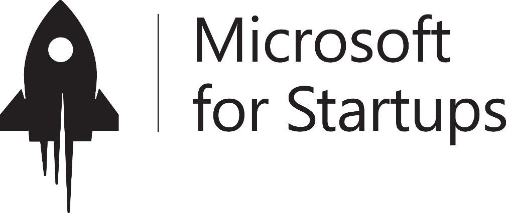
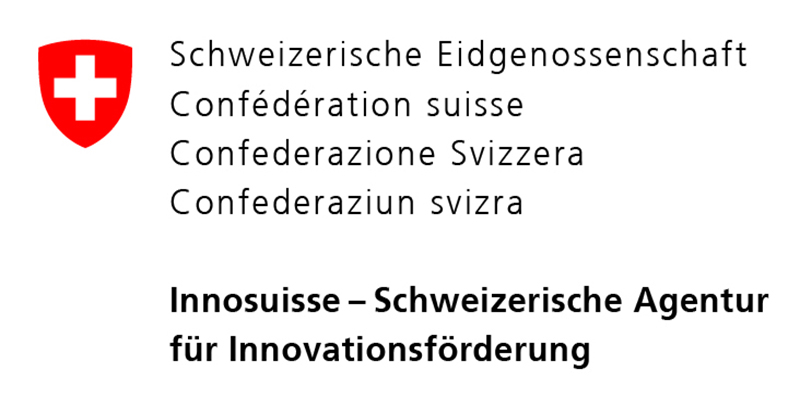

   <!-- Hero Section -->
<section id="app-look" class="full-width-section">
    
    <h1>An app to help you cut your food's impact on climate</h1>
    
Track, explore, and enhance your eco-friendly food habits.

    
Discover sustainable grub spots nearby.

    
Empower your food choices with sustainability insights.

</section>

<!-- Get Involved Section -->
<section id="get-involved" class="center-content">
    <h2>Get Involved</h2>
    

        <a href="https://wemakeit.com/channels/epfl?locale=en" class="cta-button">Help us raise funds to develop our app</a>
        <a href="https://forms.gle/jSnLZz8VALAmCsTD9" class="cta-button">Sign up as Slow Grubbers beta tester</a>
    

</section>

<!-- Challenges Section -->
<section id="problems" class="center-content">
    <h2>🌍 Challenges We Address </h2>
    <ul>
        <li>🛑Lack of digital tools to track food emissions.</li>
        <li>🛑Connecting eco-friendly restaurants with consumers.</li>
        <li>🛑Greenwashing undermining trust.</li>
        <li>🛑Missing nutrition scores in the food service landscape.</li>
    </ul>
</section>

<!-- Achievements Section -->
<section id="achievements" class="center-content">
    <h2>🏆 Our Achievements </h2>
    <ul>
        <li>✅100% Plant-based BBQ in Geneva </li>
        <li>✅Innosuisse Business Concept Training </li>
        <li>✅Microsoft for Startups Switzerland cohort </li>
        <li>✅EPFL Ignite Design & Prototype Grant (CHF 5k) </li>
    </ul>
</section>

<!-- Team Section -->
<section id="team" class="center-content">
    <h2>👥 Meet the Team </h2>
    

        

            
            
Rahul Jha

            
PhD candidate in Management at UNIGE, MBA/Telecommunication Engineering

            <a href="https://www.linkedin.com/in/r-jha/" target="_blank">LinkedIn</a>
        

        

            
            
Gianrocco Lazzari

            
Data Science expert, MSc in Physics, PhD at EPFL

            <a href="https://www.linkedin.com/in/gianroccolazzari/" target="_blank">LinkedIn</a>
        

        

            
            
Lorna Muddiman

            
Human Rights, ex Twitter, Tech Policy specialist

            <a href="https://www.linkedin.com/in/lorna-m/" target="_blank">LinkedIn</a>
        

    

</section>

<!-- Supported By Section -->
    <section id="supported-by" class="center-content">
        <h2>Supported by</h2>
        

            

                
                
Microsoft

            

            

                
                
EPFL Innovation Park

            

            

                
                
EPFL Startup Support

            

        

    </section>

<!-- 
 -->
